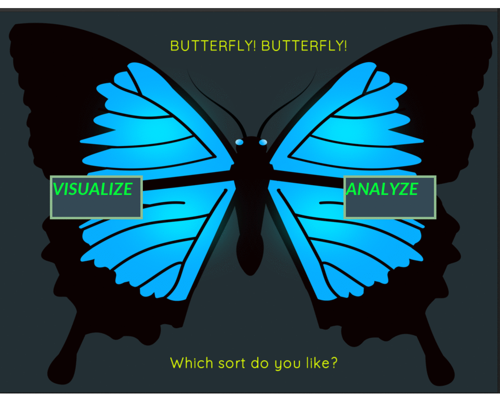

# BUTTERFLY!!BUTTERFLY!! Which sort do you like?


## Abstract

We have got so many sorting algorithms. Some would say Quick sort is better than bubble because it has got *nlogn* Big(O) time complexity. But what about Heap sort and Quick sort? What about Bubble and Insertion?

The project is all about addressing such curiosities along with visualization of some common sorting algorithms.


This project is developed as a Final-Project for the course of Data Structures and Algorithm on fourth semester of Computer Engineering Discipline.





### Built With

The project is implemented in C++.
It uses [SFML](https://www.sfml-dev.org/) as a graphics library.

### Disclaimer

The algorithm implementation is optimized to execute in the best possible time so as to make algorithm independent of the programming language used. The data for time taken vs size of data may vary somewhat on different machines.

The project is only tested on linux system.

### Prerequisite 

> Your device should have SFML installed 

```bash
sudo apt update
sudo apt install libsfml-dev
```

After installation browse to the project directory

Run the following command 

```bash
chmod +x run.sh
./run.sh
```
